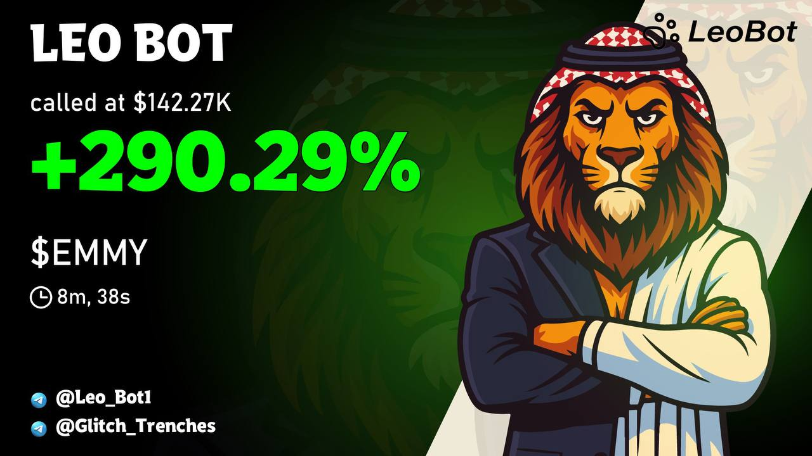
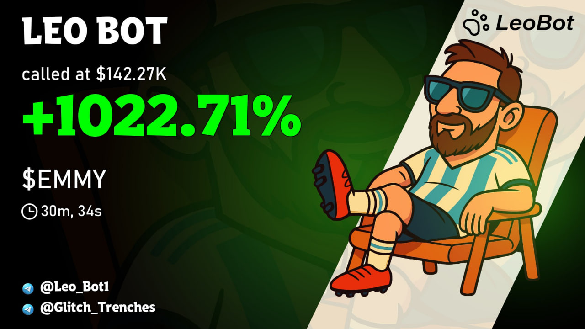
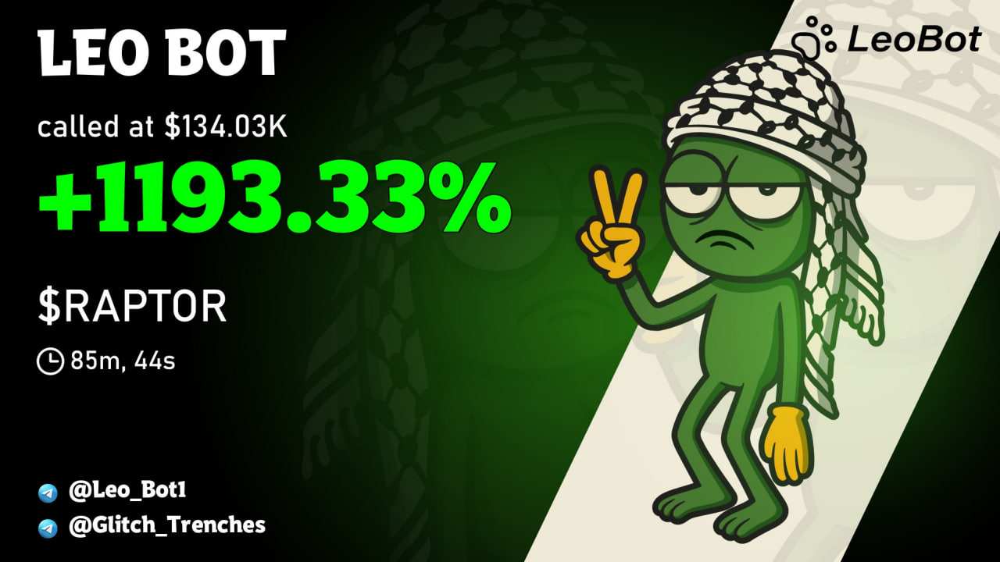
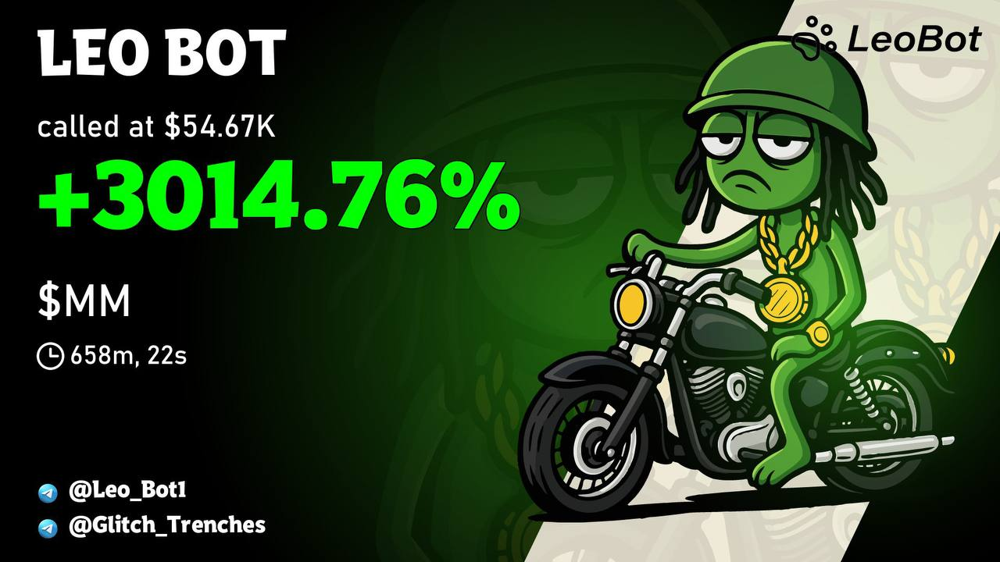
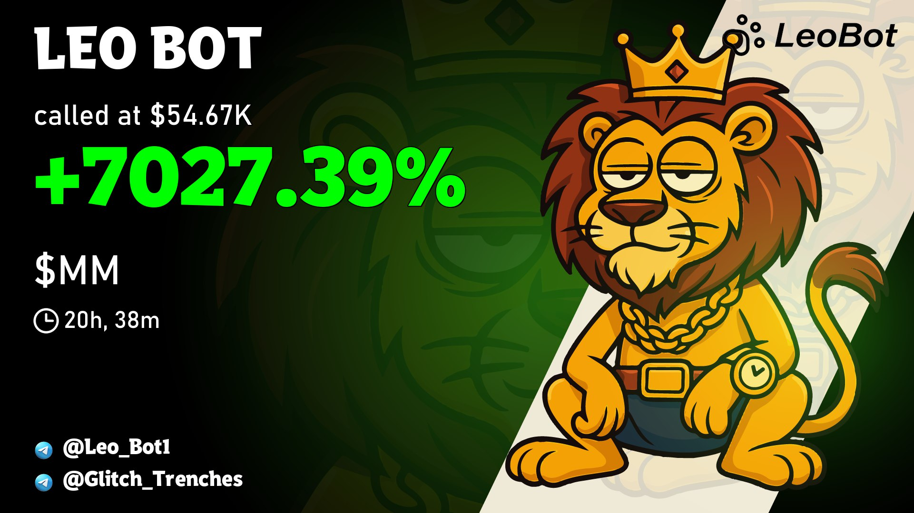
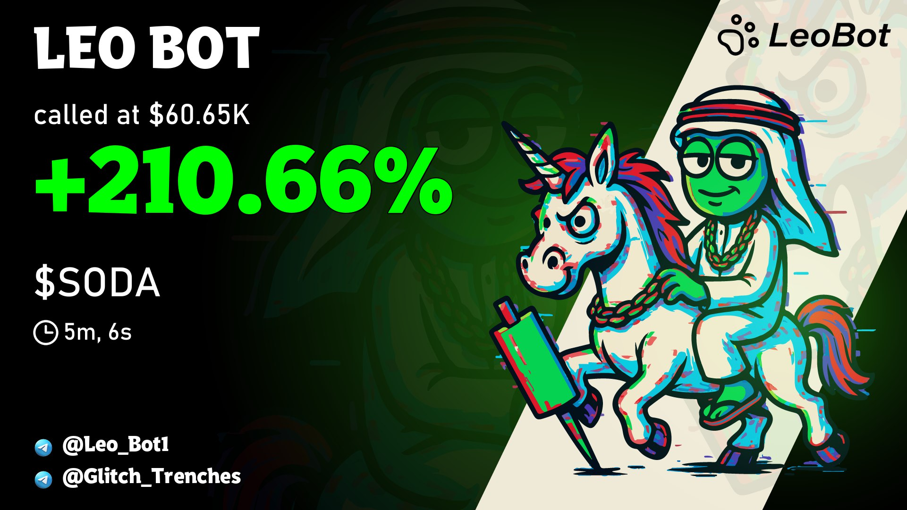
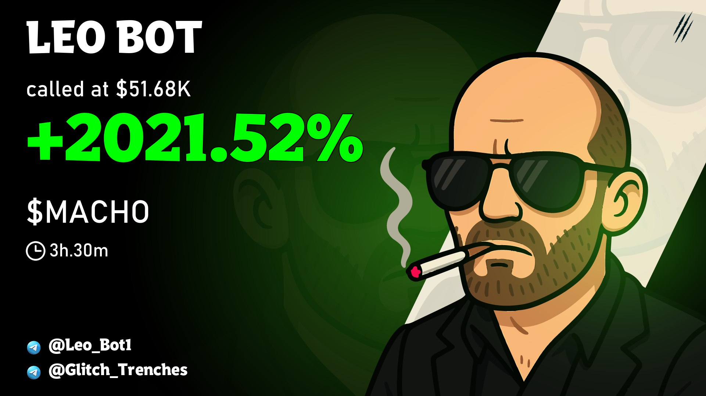
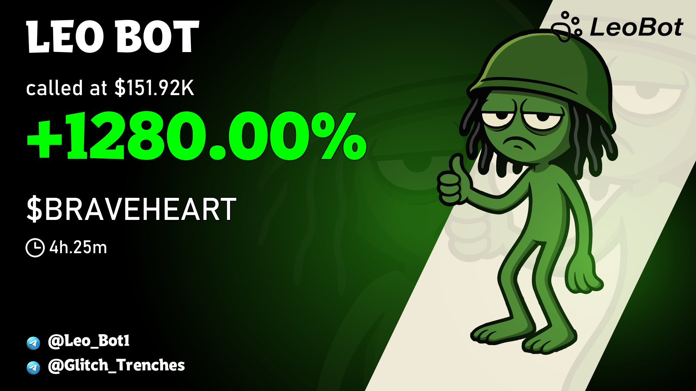

# LEO_BOT — Solana Meme-Coin Alerts

> Real-time alert bot for **Solana meme coins**. It aggregates signals across major Solana platforms, applies strict quality filters, avoids likely rugs, and posts clean notifications to a **Telegram channel** only when market and filter criteria are met.

---

## Highlights
- 🔔 **Live notifications** to your Telegram channel  
- 🧠 **Quality filters**: market cap, volume, holders, pair age (time/mins), **Top-10 holders concentration**  
- 🛡️ **Rug-avoidance rules** to drop unsafe/unknown snapshots whenever possible  
- 📊 **Only posts “fit” tokens** matching the active market window and your thresholds  
- 🌐 **Covers Solana platforms** for meme-coin discovery (launchpads, DEX trackers, on-chain feeds)

---

## How it Works (brief)
1. Collects listings and on-chain snapshots from multiple Solana sources.  
2. Picks the best trading pair (liquidity & quote).  
3. Applies your **effective filters** (baseline + runtime overrides).  
4. If a token passes and market is suitable, the bot posts a concise Telegram alert.  
5. The system keeps tracking tokens for performance and growth milestones.

---

## Filters & Rules
- **MCAP**:  
- **Volume**: 
- **Holders**: 
- **Pair Age**:  
- **Top-10% concentration**:   
- Unknown or out-of-range Top-10% → **rejected**.  
- Internal safety checks aim to **avoid rugs** (best-effort, not a guarantee).

---

## Delivery
- Channel-friendly messages with clear numbers and short context.  
- Optional branded visuals for growth milestones (PnL cards).

---

## Tech Stack
- 🦀 **Rust ~75%** — high-throughput data path & safety checks  
- 🐍 **Python ~25%** — orchestration, Telegram I/O, rendering

> Percentages reflect the intended codebase mix.

---

## Notes
- No financial advice. Crypto markets are highly volatile.  
- Rug-avoidance is best-effort. Always do your own research.  
- Secrets/keys are kept out of public repositories by design.

---

## Contact
developed by : https://t.me/Sayedadriano
Called by : https://t.me/Leo_Bot1
owned by : https://t.me/Glitch_Trenches

<!-- HERO / الشعار -->

  

<!-- جاليري بطاقات LEO BOT (4×2) -->
<table>
  <tr>
    <td></td>
    <td></td>
    <td></td>
    <td></td>
  </tr>
  <tr>
    <td></td>
    <td></td>
    <td></td>
    <td></td>
  </tr>
</table>

